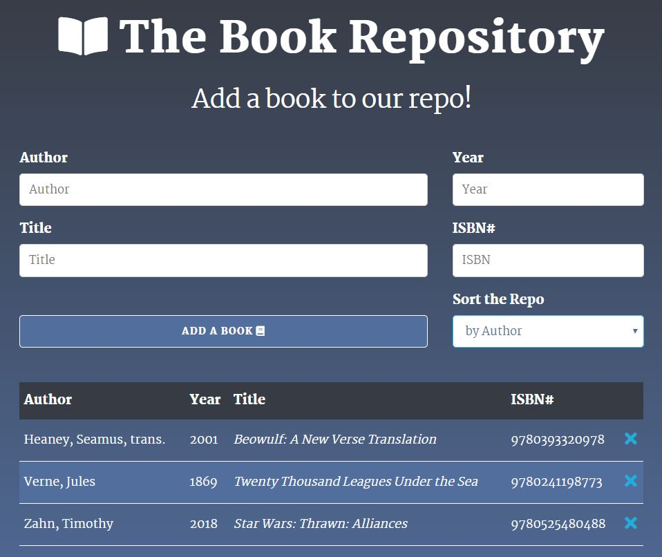

#  theBookRepository

*theBookRepository* is a bibliography app created under the direction of [Brad Traversy](https://www.udemy.com/modern-javascript-from-the-beginning/) in his *Modern JavaScript from the Beginning* course. The app uses the following technologies:

  * JavaScript ES5
  * JavaScript ES6
  * HTML
  * CSS
  * Skeleton

It is first written in ES5, and then rewritten in ES6 as an object oriented programming exercise in refactoring constructor functions into classes.

### Features

The app takes advantage of local storage for data persistence on the front end. Books added to the list appear immediately in the user interface. The book list can also be sorted according to author, year, or title. The last sort preference persists in local storage. On delete, the book is immediately removed from both the user interface and local storage.

### Alerts and Error Handling

Empty entries are not recorded, and are accompanied by temporary alert. Similar alerts likewise accompany the successful addition of a book, and the removal of a book from the list. 

